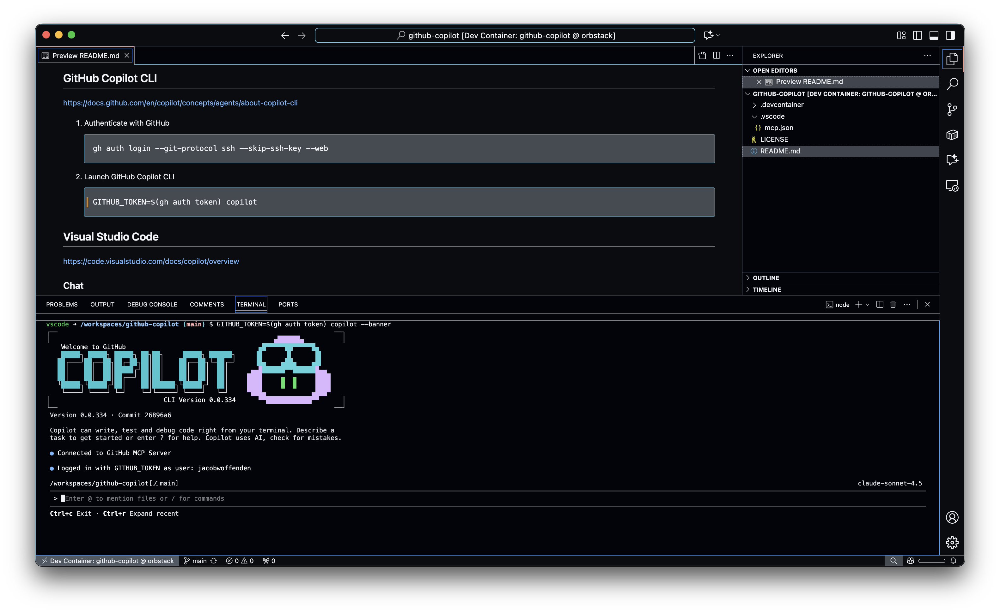

# GitHub Copilot

[](https://vscode.dev/redirect?url=vscode://ms-vscode-remote.remote-containers/cloneInVolume?url=https://github.com/jacobwoffenden/github-copilot) [](https://codespaces.new/jacobwoffenden/github-copilot)

A collection of notes and configuration for using [GitHub Copilot](https://github.com/features/copilot) :copilot:

## GitHub Copilot on the web

There are several options available for using GitHub Copilot on the web:

### Chat

https://docs.github.com/en/copilot/how-tos/chat-with-copilot/chat-in-github

### Agents

https://docs.github.com/en/copilot/concepts/agents/coding-agent/about-coding-agent

### Spaces

https://docs.github.com/en/copilot/concepts/context/spaces

### Spark

https://docs.github.com/en/copilot/concepts/spark

### MCP Registry

https://github.com/mcp

## GitHub Copilot CLI

https://docs.github.com/en/copilot/concepts/agents/about-copilot-cli

1. Authenticate with GitHub

    ```bash
    gh auth login --git-protocol ssh --skip-ssh-key --web
    ```

1. Launch GitHub Copilot CLI

    ```bash
    GITHUB_TOKEN=$(gh auth token) copilot
    ```



## Visual Studio Code

https://code.visualstudio.com/docs/copilot/overview

### Chat

https://code.visualstudio.com/docs/copilot/chat/copilot-chat

Useful settings:

```json
{
  "chat.agent.enabled": true,
  "github.copilot.chat.commitMessageGeneration.instructions": [
    {
      "text": "Use British English spelling."
    },
    {
      "text": "Use conventional commit message format."
    }
  ],
  "github.copilot.nextEditSuggestions.enabled": true,
}
```

### MCP

https://code.visualstudio.com/docs/copilot/customization/mcp-servers

An example configuration is available at [`.vscode/mcp.json`](.vscode/mcp.json)

## GitHub Copilot Instructions

This repository includes a [`.github/copilot-instructions.md`](.github/copilot-instructions.md) file that provides custom instructions to GitHub Copilot. This file helps Copilot understand your project's specific conventions, coding standards, and best practices to provide more contextually relevant suggestions.

The instructions file includes guidance on:

- Project overview and technology stack
- Code style and naming conventions
- Testing standards and patterns
- Documentation requirements
- Git practices and commit message formatting
- Security and performance considerations
- Project-specific guidelines and domain logic

GitHub Copilot automatically reads this file when providing suggestions in your repository, ensuring that generated code aligns with your team's standards. You can customize this template to match your project's specific needs.
